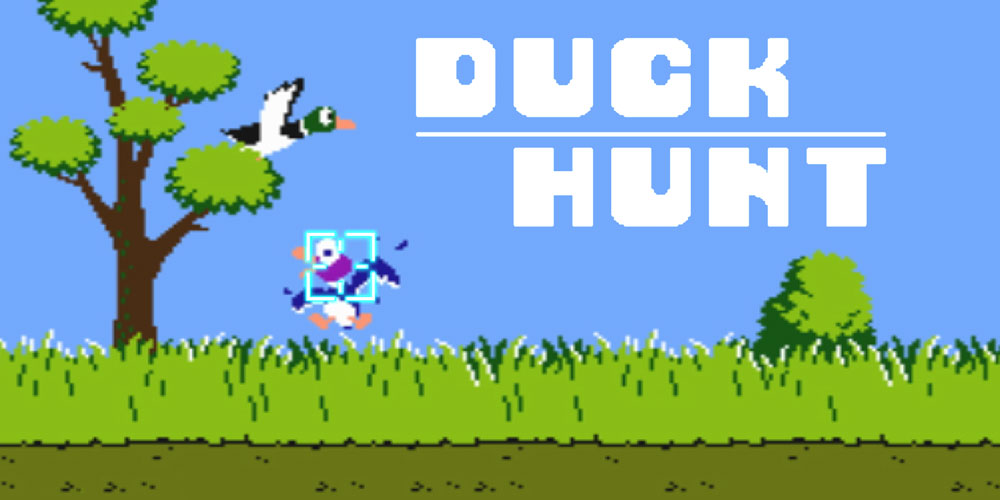

 

Este proyecto es una versión mejorada del clásico **Duck Hunt**, desarrollada como parte de la materia **Procesamiento Digital de Señales (PDI)**.

La propuesta consiste en reemplazar el uso del mouse por **interacción por gestos**, utilizando **OpenCV** para controlar el juego con los movimientos de la mano capturados en tiempo real por la cámara del computador.

---

## 🕹️ ¿Qué hace diferente a esta versión?

- 🎥 Control 100% por **visión computacional**
- ✋ Disparos mediante el **cierre de la mano**
- 🚫 No requiere teclado ni mouse
- 🧠 Aplicación real de **seguimiento de objetos** y procesamiento digital de señales

---

## 🛠️ Tecnologías utilizadas

- **Python**
- **Pygame** (base del juego)
- **OpenCV** (detección de mano y control por gestos)
- **Mediapipe** (para detección precisa de manos, si aplica)

---

## 🚀 ¿Cómo ejecutar el juego?

1. Clona el repositorio:

   ```bash
   git clone https://github.com/tu-usuario/Duck-Hunt-Cam.git
   cd Duck-Hunt-Cam
   ```

2. Instala las dependencias necesarias:

   ```bash
   pip install -r requirements.txt
   ```

3. Ejecuta el juego:

   ```bash
   python main.py
   ```

   Asegúrate de tener tu **cámara web encendida**.

---

## 🧠 ¿Cómo funciona el disparo?

Gracias a la integración con OpenCV, el sistema reconoce la mano en pantalla y **detecta cuándo se cierra** (como si formaras un puño). Esta acción simula un clic del mouse y dispara en el juego. Todo el control se realiza con **gestos naturales**, mejorando la accesibilidad e interacción.

---

## 📸 Captura de pantalla


---

## 📚 Créditos

- Basado en el proyecto original de **Duck Hunt en Pygame**
- Adaptado e implementado por [Tu Nombre o GitHub]
- Curso: Procesamiento Digital de Señales (PDI) – 2024

---

## 📌 Notas

- Puede requerir buena iluminación para mejorar el seguimiento.
- Compatible con sistemas operativos que soporten Pygame y OpenCV.

---

## 📌 Notas

- Puede requerir buena iluminación para mejorar el seguimiento.
- Compatible con sistemas operativos que soporten Pygame y OpenCV.
